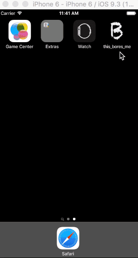
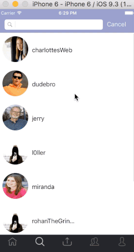
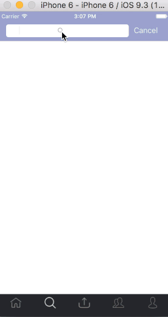
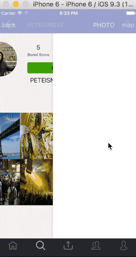

# this_Bores_Me

thisBoresMe is a mobile social media application that enables users to share media and information in real time.  Beyond the conventional social media applications, thisBoresMe features interactive geolocation-based posting and browsing capacities that advances the social media convention to an interactive 3D experience.

Perhaps the driving feature of thisBoresMe is the inversion of the the 'like' or 'retweet' genre of feedback.  Uniquely, thisBoresMe provides users the ability to rate the posts of other users as 'boring' if they see fit.  All posts on thisBoresMe feature a 'bored score' and as such popularity of a post is measured by its ability to bore other users.  This inverts the social media experience as a means to personal validation and places humor and humility as the champion cause.

At long last in the age of social media thisBoresMe not only provides users with the ability to share media with their friends and connect with new users in their proximity, but finally encourages users to let other users know when they find their posts to be tiresome, drab or even a straight up waste of time.  

## Backend

thisBoresMe is a native iOS mobile application built in Swift 2.3 via Xcode 7.3.1.

thisBoresMe uses [Parse Server deployed to Heroku](https://devcenter.heroku.com/articles/deploying-a-parse-server-to-heroku) for its backend.  Creating the database - hosted as a MLab (MongoDB) database - and deploying to Heroku is straightforward and provides an agile mobile backend that allows for all of the logic to occur within the view controllers of the application. Using [Parse-Dashboard](https://github.com/ParsePlatform/parse-dashboard) during development as a local browser-based API interface added efficiency and agility to the development process itself.

Although MongoDB is a NoSQL database platform, Parse allows thisBoresMe embrace the self-relational User class much like the classic social media applications: a user can follow another user and via the creation of a unique instance of the Follow class in which there is a 'follower' user ID and a 'followed' user ID.  Likewise, Parse also provides various one-to-many relationships with query logic built into the view controllers of the application.  The Parse API configuration occurs in the Appdelegate file, and the API itself is easily invoked for HTTP calls throughout the application.

## Login

thisBoresMe provides users with the ability to quickly login via Facebook OAuth.  

Once the users grants permission, the application is able to access the user's first name, last name, email address and user avatar.  Once logged in the user is asked to create a username/handle of the application and has the option of using thisBoresMe with the user avatar inherited from Facebook or creating a new user profile picture which can be changed at anytime.

Facebook grants a specific authorization key which is stored with the user data in the database - should a user login with another device or revive an idle account, secure access to the application will be granted via this Facebook authorization key.  It was decided that the only means of logging into thisBoresMe would be via Facebook Oauth, both for efficiency and security but also to make it easy to share the application on Facebook and encourage users to invite their friends to join via Facebook access as well.

# Main Application Interface

Once logged in the main application interface is split and accessible via a navigation tab bar on the bottom of the screen.  The tabs include a home button - or a common news feed, a search button for searching for other users and browsing pics, an upload button for contributing posted pics to thisBoresMe, a news tab for all news pertinent to the current user, and finally a 'my profile' tab

# Home NewsFeed

The first tab / the initial home page is a chronological news feed of posts by users who are followed by the current user.  Rather than 'likes' the user has the ability to give posts on his newsfeed a 'boredScore' - on a scale of 1-3 the user can rate his level of boredom concerning each post.  Rather than the 'likecount' tallies of Facebook and Instagram popularity is measured in boredom at thisBoresMe.

# Searching and browsing posts

A new user can easily search for his friends by searching by username.  The searching interface allows the user to type in a username or word and browse the matches.

The user can browse the pages of other users and follow them as desired. A user's pics can be browsed via a collection view like Instagram or, unique to thisBoresMe, a user's posts can be browsed via an interactive geo-location map.

# Uploading an image with its location

Contributing to thisBoresMe is as easy as uploading an image from your 

#Hashtags

Like the major social media platforms, thisBoresMe provides #hashtags as a means of organizing, promoting and browsing pics.  Just as a user can browse another user's pics by location, a hashtag can be explored the same way.  In this example the user is browsing pictures locally hashtagged with #golf

